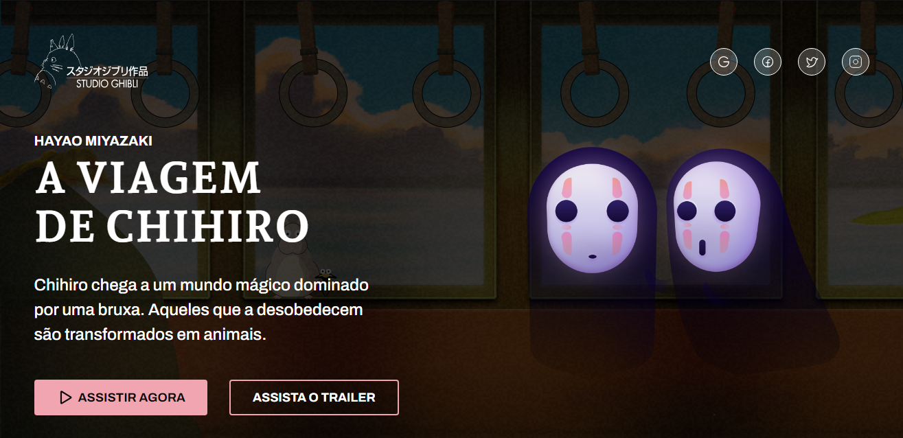

# Desafio 05 - Blog Codelândia 

Quinto desafio da comunidade Codelândia

## Índice
- [Desafio 05 - Blog Codelândia](#desafio-05---blog-codelândia)
  - [Índice](#índice)
  - [Visão Geral](#visão-geral)
    - [Screenshots](#screenshots)
      - [Site](#site)
    - [Link](#link)
  - [Meu Processo](#meu-processo)
    - [Tecnologias/Programas Utilizados](#tecnologiasprogramas-utilizados)
  - [Conclusão](#conclusão)

## Visão Geral 

Vamos dar uma resumida? O projeto é basicamente como se fosse um blog do filme A Viagem de Chihiro, onde têm uma descrição, botões de rede sociais logo no header do site e dois botões onde um é para assistir o filme e o outro para assistir o trailer do mesmo.

OBS: Os elementos são apenas estilização, tanto os botões de rede sociais como os botões de assistir e trailer são meramente ilustrativos.

### Screenshots

#### Site

### Link

- Site do Studio Ghibli: [Studio Ghibli](https://desafio-studio-ghibli.vercel.app)

## Meu Processo
De forma simples e objetiva, utlizei basicamente Flexbox, para alinhar os elementos da forma correta no site, e usando media query para deixar o site responsivo tanto para a versão de tablet, tanto na versão de mobile.

### Tecnologias/Programas Utilizados

- HTML
- CSS
- Git
- VSCode
- Figma

## Conclusão

Depois de ter feito uma quantidade considerável de projetos utilizando apenas HTML e CSS, desafios usando apenas essas tecnologias são bem tranquilos para se trabalhar do que no começo dos meus estudos, agora vou focar totalmente em projetos com JS para desenvolver minhas habilidades no mesmo.